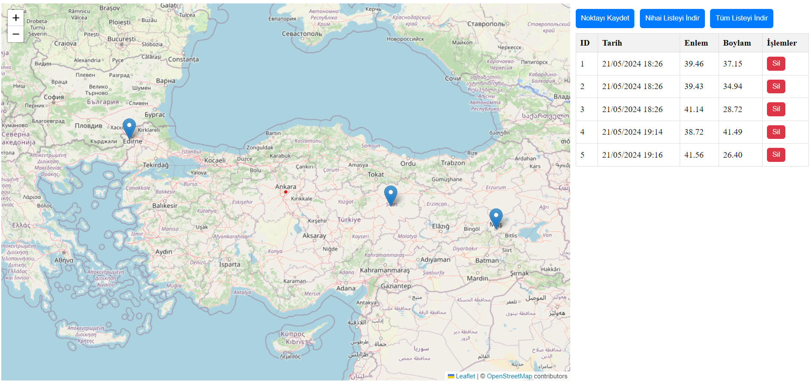

# Proje Açıklaması

Bu proje, bir harita uygulamasında, kullanıcıların merkez noktanın GPS koordinatlarını kaydedip yönetmelerine olanak tanır. Özellikler şunlardır:

- **GPS Koordinat Kaydı:** Her butona basıldığında, o sırada haritanın tam ortasında bulunan GPS koordinatları (lat/lng), tarih bilgisiyle birlikte bir .json dosyasına kaydedilir.
- **Koordinat Listesi:** Daha önce eklenmiş noktalar, sayfanın sağ tarafında bir listede görüntülenir.
- **Marker Ekleme:** Listedeki herhangi bir noktaya tıklandığında, ilgili GPS koordinatında bir marker (işaretçi) haritada görüntülenir.
- **Eleman Silme:** Liste üzerinden istenilen herhangi bir eleman silinebilir.
- **Liste İndirme:** Oluşan nihai liste veya tüm liste, .json formatında indirilebilir.
- **Yeniden Yükleme:** Sayfa yenilendiğinde tüm liste yeniden yüklenir.
- **Ayrık Geliştirme:** Uygulamanın frontend ve backend kısımları ayrı ayrı geliştirilmiştir.

## Frontend

- **Angular Version:** 16.2.14
- **Kaynak Paketleri İndirme:** `npm i`
- **Çalıştırma:** `ng serve`

## Backend

- **Çalıştırma:** `dotnet run --project MapPoints.API`
